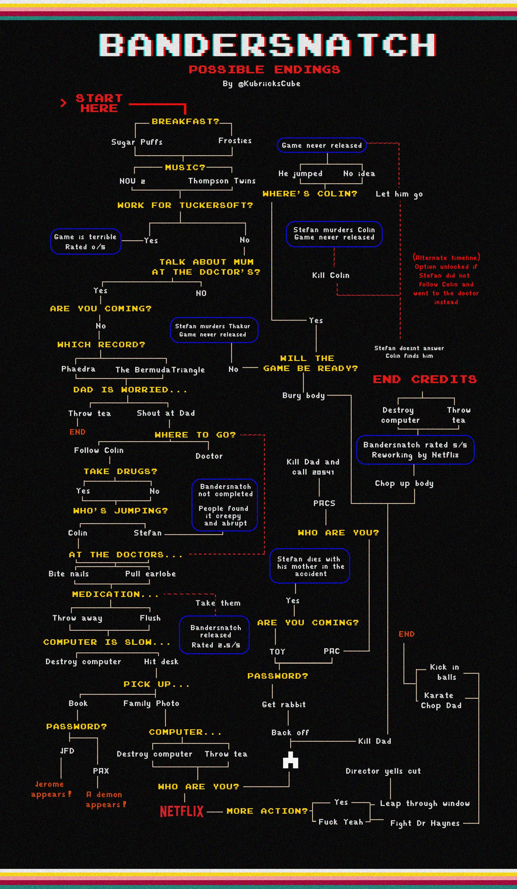

# Bandersnatch Game (Terminal Text-Based)

This project is a text-based interactive adventure game inspired by the "Bandersnatch" episode from *Black Mirror*. The game allows players to navigate through different scenarios by choosing between two options at each stage. The game uses Rust and the `crossterm` crate for terminal-based interactions.

## Features

- Terminal-based gameplay with raw mode for input capture.
- Multiple-choice decisions leading to different paths and endings.
- Retro-style banner UI in the terminal.
- Navigate the game with keyboard inputs (`←`, `→`, and `q` to quit).
- Multiple story stages with branching options.

## Prerequisites

- Rust (Ensure you have Rust installed on your system)

## Setup

1. Clone the repository:

    ```bash
    git clone https://github.com/yourusername/Bandersnatch-Text-Journey.git
    cd bandersnatch-game
    ```

2. Build the project:

    ```bash
    cargo build
    ```

3. Run the game:

    ```bash
    cargo run
    ```

## How to Play

- The game presents a scenario with two choices at each stage.
- Use the left arrow key (`←`) to select the left option and the right arrow key (`→`) to select the right option.
- Press the `q` key at any time to exit the game.
- After each decision, the game progresses to the next stage, leading to different outcomes based on your choices.

## Game Stages

The game contains a series of stages where you must choose between two options. Each option leads to a different stage or ending. Some stages are "endings" and will conclude the game. Your goal is to navigate through these stages and experience different endings.

## Visual Guide (Step-by-Step)

To help you navigate through the game's levels, here’s a step-by-step visual guide:



## Code Overview

- **`Stage` struct**: Defines each stage of the game with a message, two choices, and the next stages based on those choices.
- **`methodofline()` function**: Initializes terminal raw mode, defines the stages, and starts the game loop.
- **`game_logic()` function**: Manages the game flow, listens for key events, and handles stage transitions.
- **`draw_banner()` function**: Displays a stylized banner for each stage with the options in the center of the terminal screen.

### Dependencies

This project uses the following dependencies:

- [`crossterm`](https://docs.rs/crossterm/): A cross-platform terminal manipulation library for Rust. Used for handling terminal input, cursor movement, and styling.

You can find these dependencies in the `Cargo.toml` file.

## Controls

- **Left arrow (`←`)**: Select the left option.
- **Right arrow (`→`)**: Select the right option.
- **`q`**: Exit the game.

## License

This project is licensed under the MIT License. See the [LICENSE](./LICENSE) file for details.

